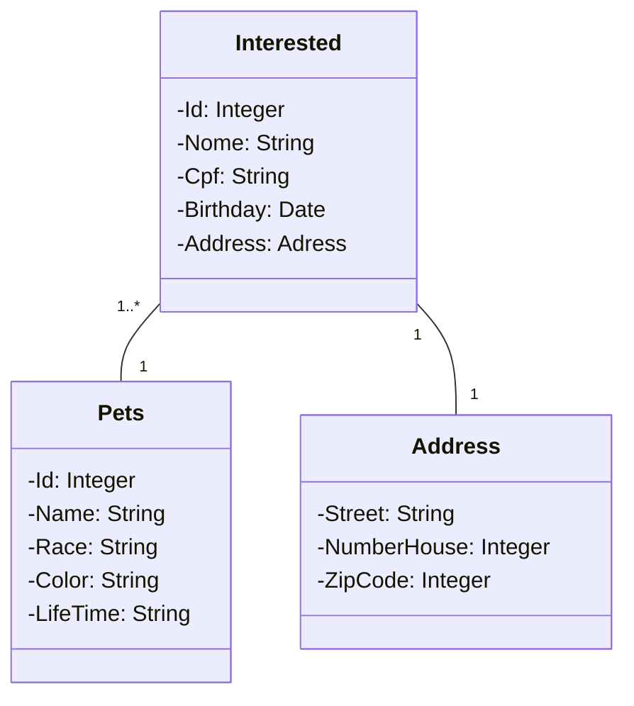

# me-adota

## Aplicação desenvolvida em Kotlin + Spring Framework
## Aplicação voltada para um ambiente de adoção de pets, relacionando a adoção entre uma pessoa/cliente e um pet a ser adotado.
### Back-end sem a implementação de testes integrados e unitários ( necessário um estudo aprofundado )

